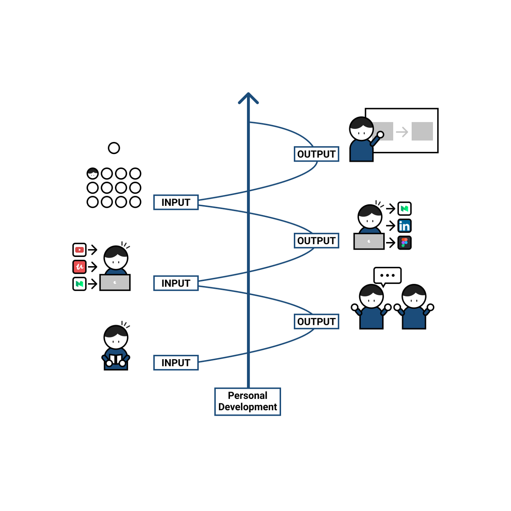

# Why do you understand English but cannot speak fluently?
## Inputs & Outputs

**Disclaimer:** this whole post revolves around a delightful [Youtube's video](https://www.youtube.com/watch?v=oXOTlM9n-_k) by [Ruri Ohama](https://www.youtube.com/c/RuriOhama) that I happened to see one rainy afternoon when I got caught up in YouTube's recommendations (thanks for discovering this for me, you _lovely_ algorithm).

Many of us have been trying for years to learn a second language (in my case English) without succeeding as well as we would like. And that's because (or at least that's how it has been in my case) the system or method we have been using has always been "**Input Based**".

I will go into details about what it means but we can summarize it as follows: we are able to "understand" some conversations or sentences (because it is something we have trained a lot) BUT we do not manage to give complex answers or keep those conversations fast and fluent (because we have NOT trained it at all). 

### What Input Based learning is?

**The four fundamental skills of language learning are: reading, listening, writing and speaking** (if you look closely at that list, it seems that people tend to order them in this way: inadvertently giving more priority to the first ones than to the last ones).

These skills are in turn divided into two different groups or learning styles:
* **Input Based:** reading and listening (also known as "the receptive skills" and/or passive learning).
* **Output Based:** writing and speaking (aka "the productive skills" and/or active learning).


by [Anson Wong](https://ansoncwwong.medium.com/my-reflection-on-the-power-of-input-and-the-power-of-output-by-shion-kabasawa-69c006db57f8)

**Is one learning style better than the other? Definitely NO**. To learn a language we must be able to master well the four fundamental skills because they are somehow interconnected. **The real problem is the (unbalanced) amount of time and effort we devote to each of them**. 

According to what [Shion Kabasawa](https://www.goodreads.com/author/show/18375488.Shion_Kabasawa) states in his books _The Power of Input: How to Maximize Learning_ and _The power of Output: How to Change Learning to Outcome_ (it seems that we can only get them in Japanese, tho), **we are used to spend on average much more time and effort on Input Based skills than on Output Based skills in a ratio of 7:3** (2.5x more time on the former than on the latter) **when we should be doing quite the opposite**, leaning more towards Output (Input: Output -> 3:7). 

I can't tell you how he has arrived at those figures but I think he's not far off the mark because, for instance, think of how many people tell you that they are learning a second language and are satisfied—even bragging about it—with just watching TV, series or movies in VO (and/or sometimes reading a book or whatever)... their Input:Output ratio is basically 7:0! 

You can't be any good at a sport just by watching [videos on TikTok about that sport](https://www.tiktok.com/@worldpadeltour)... you have to actually play the sport!

> “being pushed to produce language puts learners in a better position to notice the ‘gaps’ in their language knowledge”, encouraging them to ‘upgrade’ their existing interlanguage system. And, as they are pushed to produce language in real time and thereby forced to automate low-level operations by incorporating them into higher-level routines, it may also contribute to the development of fluency.  - Scott Thornbury ([P is for Push]( https://scottthornbury.wordpress.com/tag/output-hypothesis/))

### How can I do more Output Based learning?
```
Before talking about the main advice (reason why I am writing this whole post) that Ruri Ohama shares in her video, 
here is another small but important piece of advice from her about the Input Based part: 
we should try to listen more than read and/or try to find as soon as possible how is the pronunciation 
of the new words we come across because we tend to "make up" the pronunciation and that can become a real problem 
in the long term because if we repeat several times the pronunciation incorrectly our brain "records" it like that 
and it's quite hard to correct it later.
```

I am aware that listening or reading is quite easy and convenient because we can do it on our own in a wide range of situations, being able to do it even in the course of another activity (although, as you know, it is not the most desirable ), writing can be tedious/boring (it is funny that we almost always excuse ourselves in the "lack of ideas") and **speaking has this great inconvenience that we need an interlocutor**. But we have to go beyond our comfort zone and change our mindset to shift our Input-Output ratio from 3:7 to 7:3 (or at least balance it better to something closer). Little by little.

> "You don’t have to do a lot every day, but you have to do something. Something. Every day." - [Callie Oettinger](https://stevenpressfield.com/2019/02/do-this-every-day/)

Just as boxers or fighters practice [shadow boxing](https://en.wikipedia.org/wiki/Shadowboxing), we can do the same in some way to practice speaking.

**What Ruri Ohama does after every video she watches is try to summarize it and explain it to an imaginary friend**—(she is aware that this may sound creepy)—**using her own words and trying to use the new vocabulary she has heard**. Simple, yet effective.

Try to speak out loud and not using the inner voice in order to strengthen the mind-mouth connection (otherwise, you will still speak fluently in your mind but you will choke when speaking out loud). This does not mean that we have to start talking to ourselves on the way to work, walking down the street or on public transport as if we were crazy. We should try to find some time when we can do it without disturbing others, such as explaining what we've heard, read or seen (the list is endless: you can TALK about what happened yesterday, your bedtime book, stories you heard at the office, that new kitten video you saw on Instagram, an experience you had, some new fact, that new boring episode you watched on Netflix, what you ate, what you're going to do next, your upcoming vacation, what's trending, the news of the day, etc.) while *(todo: insert here another endless list 😉)* you take a shower, cook, get dressed, clean the house, etc. 

```
Try to make a story and not just a list of unconnected words or phrases (this is related to [episodic memory](https://en.wikipedia.org/wiki/Episodic_memory) but is off the topic of this post).
```

If I tell an imaginary friend, who will correct my grammar, vocabulary and/or pronunciation mistakes? Unfortunately, we can't have everything, although **we can always use tools or services to help us with this**[^1] (and by this I do not mean the "platform" that promotes the Ruri's video or similar 😒). 

### Lack of courage

Another interesting point Ruri Ohama makes in her video is the *lack of courage*. **The fear of speaking a language other than one's mother tongue—in front of non-native speakers but especially native speakers—is a worldwide thing**. I know it's easier said than done, but the thing is, there will always be these kinds of people—mostly strangers; not friends of yours—who will make fun of you for your accent or your mistakes 🤷. Just accept it and try to do it better next time. *Karma* will do justice 🙃. 

Don't let perfection be your enemy. Don't sabotage yourself. The main thing is to communicate with others to the best of your ability (and for that **you have to practice the Output** too 😉). That's all.

>"Don't forget to have fun and enjoy the process." - Ruri Ohama


[^1]: Google Translator, [Grammarly](https://www.grammarly.com), [Deepl](https://www.deepl.com/), etc... note: please use the comments to specify similar tools (No Spam 🙏)