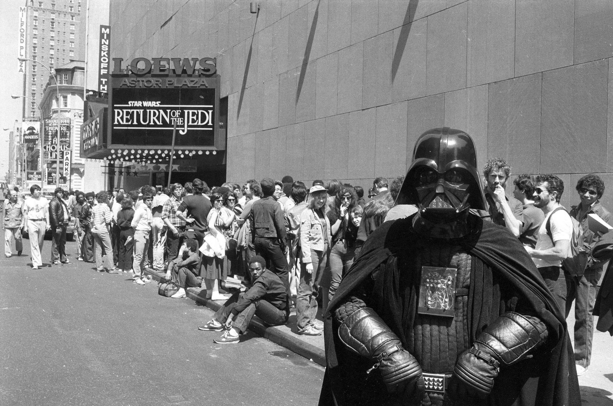
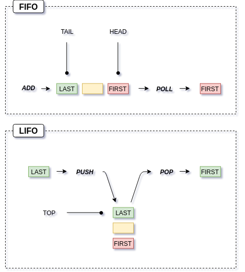

# To Queue or not to Queue?
## That should not be a question

[Waiting In Line To See Star Wars: 1977–2000](https://flashbak.com/waiting-in-line-to-see-star-wars-1977-2000-26505/)

**No one likes to stand in line¹.** Most people hate to waste their time queuing up. We spend an average of [6 months](https://www.mirror.co.uk/news/uk-news/fascinating-facts-about-how-we-spend-the-days-410973) of our adult lives waiting our [turn](http://www.dailymail.co.uk/travel/travel_news/article-3269123/How-time-spending-line-Infographic-reveals-hours-wasted-queuing-world-s-popular-tourist-attractions-s-Rome-patience-needed.html) — almost 3 days a year. There are [books](https://www.amazon.com/Does-Other-Line-Always-Faster/dp/0761181229) about queues. [Documentaries](https://www.imdb.com/title/tt7663984/)². Even [academic experts](https://www.youtube.com/watch?v=_CBD2z51u5c) in queues. But then, when we are coding, we often forget to use `queues` and end up messing around with `lists` instead.

> All things work better when you use the right tool.

#### FIFO or LIFO1!!!

A [queue](https://www.youtube.com/watch?v=IPxBKxU8GIQ) in a supermarket is **FIFO.** The way we usually [stack boxes](https://media.giphy.com/media/8RH4MrJPTnVRK/giphy.gif) is **LIFO.** **FIFO** stands for *“First In, First Out”³.* **LIFO** is the acronym for *“Last In, First Out”.* That’s it.

I used [draw.io](https://www.draw.io/) to draw this diagram. Awesome tool!

> When implementing **FIFO** queues we usually use `add`, `peek` (returns, but does not remove, the head of the queue) and `poll` (returns and removes the head of the queue) methods, while we refer to them, respectively, as `push`, `peek` and `pop` in **LIFO **stacks.

#### The STACK, the QUEUE and the DEQUE

In a `stack` we can only add and remove elements from one end (**LIFO**), in a `queue` we add elements to one end and remove them from the other (**FIFO**) and, joining those two worlds we have the `deque` (aka *“Double Ended Queue”*) where we can add and remove elements from both ends. **None of them allows random access to the elements.**

https://gist.github.com/hrules6872/03246cebe37c1b61919543ab2b92791a
https://gist.github.com/hrules6872/3349f3488dce861e2edf2af892299813
https://gist.github.com/hrules6872/b263becd04c0f144643a0c0c7c874358

> In JAVA you *should* use `deque` to model a `stack` because the Stack class [is considered obsolete](https://keithwilliamstechblog.wordpress.com/2016/02/13/why-the-java-stack-class-is-bad/) (it extends the Vector class and inherits all its methods, making it possible to break the **LIFO** principle).

### So, [don’t reinvent the wheel](https://media.giphy.com/media/d3mlE7uhX8KFgEmY/source.gif)⁴.

*****

[1] Ok, there are some [weird](https://www.theatlantic.com/technology/archive/2011/10/how-long-people-waited-be-first-line-buy-apple-products/337087/) [exceptions](https://www.independent.co.uk/life-style/gadgets-and-tech/news/iphone-x-latest-updates-news-apple-fans-queuing-photos-world-get-new-phone-a8035321.html)`:facepalm:`  [2] There is always an alternative [https://www.youtube.com/watch?v=ZyNz8UHHrxE](https://www.youtube.com/watch?v=ZyNz8UHHrxE) (in Spanish)`:wink:`  [3] Some people know it as FCFS (*“First Come, First Served”*)  [4] And remember to give [LolaMarket](https://lolamarket.com/) a chance. Awesome service!

*****

[External links 👀](https://gist.github.com/hrules6872/014457aa59de0d78abb0f35e028760ca)