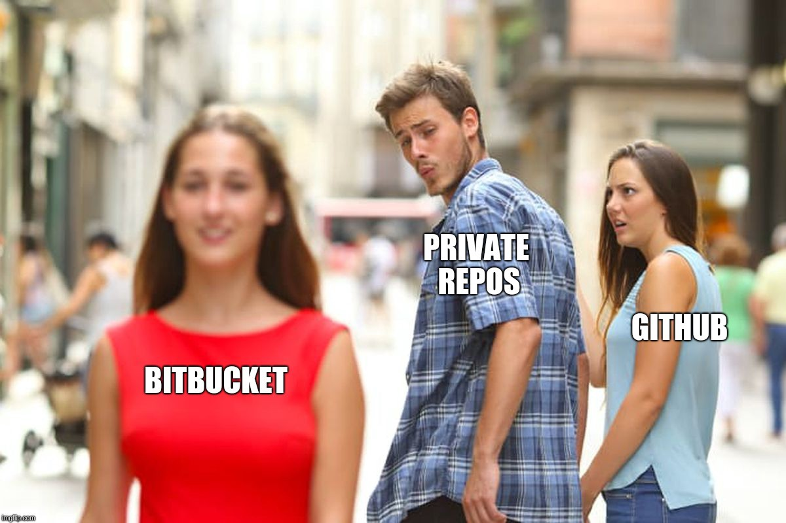

# Moving from GitHub to Bitbucket
## W̶h̶y̶ ̶a̶n̶d̶ how

> **Disclaimer:** This post is not related in any way to [Microsoft’s recent acquisition of GitHub](https://news.microsoft.com/2018/06/04/microsoft-to-acquire-github-for-7-5-billion/) (I don’t really have a very strong opinion about it; although I hope that won’t affect us at all).

Next month, my [GitHub](https://github.com/hrules6872) annual subscription will end and I don’t want to renew it in order to reduce the high number of online services I currently pay for.  **tl;dr: I’ll continue to use GitHub but not for private repositories.**

There are many alternatives out there, but I’ve decided to migrate my private repositories to [Bitbucket](https://bitbucket.org/hrules6872/)¹ (mainly because I’m used to using it at [work](https://lolamarket.com/)²). The biggest obstacle is that they don’t provide any tool to import all the repos at once (we have to do the chore one by one…) so **I’ve created a** [script](https://gist.github.com/hrules6872/af8655427e6ec7741a82516713d99ebf)**³** to fill that gap. **You’re welcome, Bitbucket** `:wink:`

#### Moving checklist

* [Python 2.7](http://lmgtfy.com/?q=install+python+2.7)
* [FromGithubToBitbucket.py](https://gist.github.com/hrules6872/af8655427e6ec7741a82516713d99ebf) script (don’t forget to make it executable using `chmod +x`)
* [GitHub personal acces token](https://github.com/settings/tokens) (scopes needed: *repo*)
* [Bitbucket app password](https://bitbucket.org/account) ➡️ Bitbucket settings ➡️ App passwords (permissions needed: *Repositories write*)
* [Bitbucket OAuth consumer](https://bitbucket.org/account) ➡️ Bitbucket settings ➡️ OAuth ➡️ OAuth consumers (permissions needed: *Repositories write&admin*)

> As you can see, we won’t expose any of our account passwords, so we can delete those temporary credentials afterwards.

#### Moving day

* [Fill in the credentials](https://gist.github.com/hrules6872/af8655427e6ec7741a82516713d99ebf#file-fromgithubtobitbucket-py-L4)
* [Setup what kind of repo do we want to import](https://gist.github.com/hrules6872/af8655427e6ec7741a82516713d99ebf#file-fromgithubtobitbucket-py-L15)
* **Run the script **and follow the instructions
* [Dance](https://giphy.com/explore/victory-dance)! 

*****

[1] Even though [some people](https://twitter.com/Syknapse) think it’s the ugliest one `:wink:`  [2] Also, I tried [Gitlab](https://gitlab.com/) long time ago and IMO their website was running slow and sluggish. Perhaps they have solved this by now, IDK `:shrug:`  [3] It has been tested under Linux/MacOS. What about Windows users? Well, can you tell me why you’re still using Windows? `:trollface:`

*****

[External links 👀](https://gist.github.com/hrules6872/fb65d6ca42c719221dfa8989e6cfef98)
