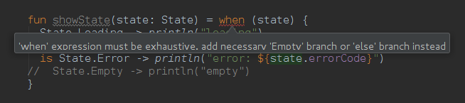

# Sealed (Class) with love
## Our new best travel companion ❤️

Among the many features that Kotlin brings to us to improve and facilitate our life while programming there are the **Sealed Classes¹**. These, combined with other features such as [Smart](https://kotlinlang.org/docs/reference/typecasts.html#smart-casts) [Casting](https://try.kotlinlang.org/#/Examples/Basic%20syntax%20walk-through/is-checks%20and%20smart%20casts/is-checks%20and%20smart%20casts.kt) and [When](https://kotlinlang.org/docs/reference/control-flow.html#when-expression) [Expressions](https://try.kotlinlang.org/#/Examples/Basic%20syntax%20walk-through/Use%20when/Use%20when.kt), will lead to **a new and safer way to model our applications**.

### What is a Sealed Class?

 “[Sealed classes](https://kotlinlang.org/docs/reference/sealed-classes.html) are used for representing restricted class hierarchies…” - [Mind blown / Mind explosion](https://www.youtube.com/watch?v=9CS7j5I6aOc)

**Sealed Classes are said to be "Enum Types on steroids"**: [they both are](https://en.wikipedia.org/wiki/Algebraic_data_type) restricted hierarchies, they both represent a set, they both are types, and they both can contain associated data, but… the first ones:

* cannot be instantiated directly because they are `abstract` (and therefore, [they can have both abstract and non abstract methods and fields](https://gist.github.com/hrules6872/b69c89d5b070eb0eb2ecc809f921bd54)) 
* can have subclasses and these can have multiples instances² which can contain
their own state
* **the type of such associated data may be different** (see the example below)

https://gist.github.com/hrules6872/ba079eaf81278319f76fd4d3cc01f531 Tip: if a subclass doesn’t keep state, it can just be an **object**.

> Sealed Classes make our intentions clear (and their use also makes our code look cleaner)

> Limitation (if we can call it that): subclasses must be declared in the same **Kotlin file** as the Sealed Class itself.

#### What about Smart Casting and When Expressions?

**When Expression** is the best partner for Sealed Classes. **Using it as an expression makes it exhaustive**: we will have to handle each and every one of its subclasses (or use an `else` clause in the worst case scenario 😞 ) or Kotlin’s compiler will complaint. This means that **if we add a new subclass in the future, it will have to be handled as well**.

Exhaustiveness Checking AKA let the compiler remind us we need to update our code

Going even further, thanks to the Kotlin’s **Smart Casting** feature, each subclass will be casted inside its `is` own clause, allowing us to access safely to its specific fields (saying goodbye to possible `ClassCastException` exceptions 🏆).

https://gist.github.com/hrules6872/2ee045a49310772f14be2bfed428a242 Tip: when comparing an **object**, as there’s only one instance, we don’t need to check its type, so we can avoid the use of the **is** operator

> **Using** `when` **as a statement doesn’t make it exhaustive.** Fortunately, [we can alter that behaviour](https://gist.github.com/hrules6872/99b007c498c919404f9961715ecbe5a7) by making use of another well-known Kotlin’s feature: [extensions](https://kotlinlang.org/docs/reference/extensions.html#extensions).

#### Ok, it seems quite cool but: can we test those Sealed Classes?

Of course, **we can**. In fact, **we** **MUST** do it 😉

> Using [Mockito](http://site.mockito.org/) as mocking framework for unit tests in Kotlin has some issues with the [Kotlin’s Null-Safety](https://kotlinlang.org/docs/reference/null-safety.html) feature because some of its matchers return [Nulls](https://github.com/mockito/mockito/blob/release/2.x/src/main/java/org/mockito/ArgumentMatchers.java#L145), so we’ll have to use [Mockito-Kotlin](https://github.com/nhaarman/mockito-kotlin) library which among other things solves these issues.

### Last words

[https://www.youtube.com/watch?v=apFIxtQdpek&t=33](https://www.youtube.com/watch?v=apFIxtQdpek&t=33)

The concept of the **Sealed Classes** is very simple but it’s the basis of a lot of new ideas and workflows. Please, feel free to let me know how you use them and why by leaving a comment below or tweet me over on [@hector6872](https://twitter.com/hector6872).

This article was originally published on [Medium](https://medium.com/@hector6872/sealed-class-with-love-e554063aa9c6)

*****

[1] Yep, I’ve written a little about this [before](https://medium.com/@hector6872/presenters-and-views-meet-the-interface-segregation-principle-1cd6c98f46bb) (look for *“BONUS: Kotlin developers”* part)  [2] Remember that a single-element `Enum` type is one of the best ways to implement a [Singleton](http://www.drdobbs.com/jvm/creating-and-destroying-java-objects-par/208403883?pgno=3)

***** 

[External links 👀](https://gist.github.com/hrules6872/2a928d798055c78bfac4635679a04fed)