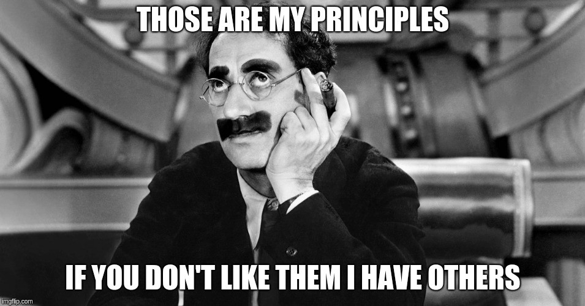

# Object-oriented programming and Greek mythology
## Principles and laws

We often find code like this and we do not give it any importance because it is quite common:

```kotlin
val model = Model(id = "whatever")

if (model.id.*isNotEmpty*()) {  // <<< look at this !!!
    doThis()
} else {
    doThat()
}

... where `model` is:

data class Model(
    val id: String = String(),
    val color: Color = Color.RED
)
```

Alright, [move on, nothing to see here, please disperse](https://www.youtube.com/watch?v=rSjK2Oqrgic).

Then, for instance, the business requirements changes and we also have to check wether its `color` is equals to `Color.GREEN` to validate that model, forcing us to look for that `if` throughout the project to update it, wasting time, making changes to a bunch of files (*aka [shotgun surgery code smell](https://refactoring.guru/smells/shotgun-surgery)*) and/or breaking something somewhere else.

At the end, we will pray that those requirements will not change again. But they always can change.

The problem here were not the requirements but the design: [why are we still asking instead of telling?](https://martinfowler.com/bliki/TellDontAsk.html)

### What is Tell, don’t ask (TDA) principle about?
>  Procedural code gets information then makes decisions. Object-oriented code tells objects to do things. 
 — Alec Sharp [“Smalltalk By Example”](https://www.amazon.com/Smalltalk-Example-Developers-Alec-Sharp/dp/0079130364) McGraw-Hill, 1997

Making decisions outside objects violates their encapsulation so **instead of [asking objects about their state](https://www.martinfowler.com/bliki/GetterEradicator.html) and then making a decision, we should tell objects what to do.**
>  To tell is a command, to ask is a query.

We should stop using the infamous [Anemic Domain Model](https://en.wikipedia.org/wiki/Anemic_domain_model) [antipattern](https://www.martinfowler.com/bliki/AnemicDomainModel.html) everywhere and **start placing the data and methods that operate on that data in the same place**:

```kotlin
val model = Model(id = "whatever")

if (model.isValid()) {
    doThis()
} else {
    doThat()
}

... where `model` is:

data class Model(
    val id: String = String(),
    val color: Color = Color.RED
) {

    fun isValid() = id.isNotEmpty() && color == Color.GREEN
}
```

By making the changes shown above we have hidden the implementation details, making our code easier to understand and [maintain](https://en.wikipedia.org/wiki/Don't_repeat_yourself): **next time any changes around that model will not affect the rest of our project**.

### Principles are not laws



We must always keep encapsulation in mind, but sometimes we have to find a balance between using **TDA** or not because strictly obeying it as if it were a law has some drawbacks:

* **classes tend to be bigger,** increasing their complexity and making them more difficult to deal with

* **the number of responsibilities increases** (*“With great power comes great responsibility.” — [Uncle Ben](https://en.wikipedia.org/wiki/Uncle_Ben#%22With_great_power_comes_great_responsibility%22)¹*) and also their coupling (think here of the typical object that is a central part of an application: we do not want god objects)

* **we may break other principles** such as [SRP](https://en.wikipedia.org/wiki/Single_responsibility_principle)
> # Tell, don’t ask principle cannot be treated like the rule of thumb (like many other principles) because we often have to ask questions.

## Law of Demeter

Normally related to the **TDA** principle we often come across the [Law of Demeter](https://en.wikipedia.org/wiki/Law_of_Demeter)² (*LoD aka “principle of least knowledge”*).

**LoD can be summed up as “friendship among objects”**: objects must be independent and be in touch only with its “closest immediate friends” and “don’t talk to strangers”.
>  A friend of my friend is…? (According to LoD) NOT my friend³.

Therefore, to achieve this behaviour we must obey this simple rule: any method of an object must only call the methods that belong to:

* itself

* its parameters (which are objects as well)

* any objects it creates/instantiates

* its direct component objects

```kotlin
class A {
    private val c = C()

    fun method(b: B) {
        b.method()
        c.method()
        Object.method()
        D().method()
    }
}
```

Although some people boil down this *law* to “counting dots” (where `model.getX().getY().doSomething()` is wrong but `model.doSomethingXY()` is fine *for no clear reason*…) and tend to use too many wrapper classes (which is the most common outcome when we try to avoid **LoD**), **we should think of LoD more as a design guideline than a law for itself**.
>  > Imagine you are in a store and the item you are purchasing is $25
> Do you give the clerk $25?
> Or do you give the clerk your wallet and ley him/her retrieve the $25?
 — Misko Hevery [“The Clean Code Talks — Don’t Look For Things!”](https://youtu.be/RlfLCWKxHJ0?t=941)

Let’s see the typical paperboy example (described deeply in [this paper](http://www.ccs.neu.edu/research/demeter/demeter-method/LawOfDemeter/paper-boy/demeter.pdf)).

Below is an excerpt of code that does not follow **LoD** (either **TDA**):

```kotlin
// given these classes

data class Neighbour(
    val firstName: String = String(),
    val lastName: String = String(),
    val wallet: Wallet = Wallet()

    ...
)

data class Wallet(
    var money: Float = 0F  // please forgive me :(

    ...
)

// when payday comes 

class Paperboy {
    companion object {
    private const val PRICE = 2f
    }

    private var earnings: Float = 0F

    fun getMoney(neighbour: Neighbour): Boolean =
    if (neighbour.wallet.money >= PRICE) {
        neighbour.wallet.money -= PRICE
        true
    } else {
        false
    }

    ...

}

The question here is: have you ever seen a paperboy 
taking money directly from a neighbour's wallet?
```

So, to follow a “real world” scenario we should make use of **LoD** (plus **TDA**) like this:

```kotlin
// given these classes

interface Payer {
    fun pay(
    service: Service,
    amount: Float
    ): Boolean
}

interface Service {
    fun pay(amount: Float)
}

data class Neighbour(
    val firstName: String = String(),
    val lastName: String = String(),
    private val wallet: Wallet = Wallet()
) : Payer {
    override fun pay(
    service: Service,
    amount: Float
    ): Boolean =
    if (hasEnoughMoney(amount)) {
        service.pay(amount)
        true
    } else {
        false
    }

    private fun hasEnoughMoney(amount: Float): Boolean =
    wallet.money >= amount

    ...

}

data class Wallet(
    var money: Float = 0F // ok, I know :(

    ...
)

// when payday comes

class Paperboy(
    private var earnings: Float = 0F
) : Service {

    companion object {
    private const val PRICE = 2f
    }

    fun getPaid(payer: Payer): Boolean =
    payer.pay(this, PRICE)

    override fun pay(amount: Float) {
    earnings += amount
    }

...

}

Ok, now everything seems a little more complex but 
now the paperboy is a good guy who ask for his/her 
money and doesn’t take anything from anyone’s wallet :)
```

**Making the connection among objects as loose as possible (“making them a little shy”) will help us to promote flexibility and facilitate code maintenance** (thanks to isolation any future changes will not have much impact on our code base) as well as enable us to test them without using lots of [chained mocks](https://twitter.com/damianguy/status/4977743956?s=19).
> # “True friendship isn’t about being inseparable, but about being separated and knowing nothing will changes” —[Ted](https://en.wikipedia.org/wiki/Ted_(film))

*****

[1] In case you are curious about the true origin of this quote: [https://quoteinvestigator.com/2015/07/23/great-power/](https://quoteinvestigator.com/2015/07/23/great-power/)
[2] “It is so named for its origin in the Demeter Project, an adaptive programming and aspect-oriented programming effort. The project was named in honor of [Demeter](https://en.wikipedia.org/wiki/Demeter)” — [Wikipedia](https://en.wikipedia.org/wiki/Law_of_Demeter)
[3] “A friend to all is a friend to none.” — Aristotle (who was also Greek)


*****

[External links 👀](https://gist.github.com/hrules6872/ad1a39005ce8eb16a665cc1e8812f8e7)