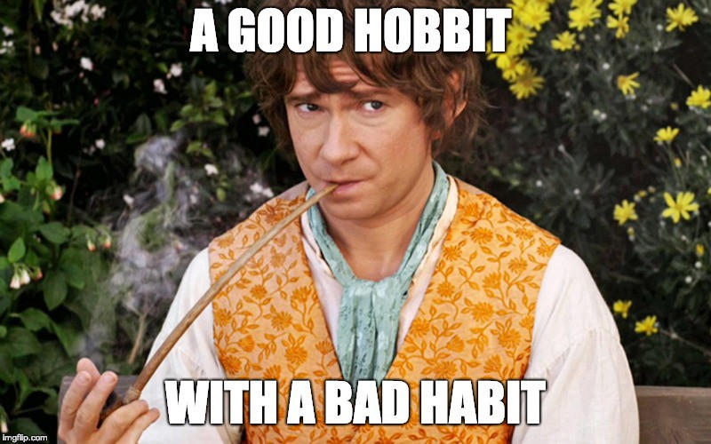

# Habits + Google Sheets = Profit!
## Because good habits are worth it

### What is a New Year Resolution?

A **New Year’s resolution** is a [tradition](https://www.history.com/news/the-history-of-new-years-resolutions) in which we make a bunch of promises¹ -on the last days of the year or so- to ourselves to do something in order to improve our behaviour or lifestyle in a good way during the year ahead (i.e. quit smoking, eat less junk food, lose weight, do some form of exercise and/or stop saying JS is a real programming language²).

Even though some they could be just a [personal goal or challenge](https://github.com/hrules6872/ResolutionBoard) (i.e. travel solo), almost every promise we make of this kind usually is -to a greater or lesser degree- **a habit** (to either make or break it).

### What is a habit?

A habit is the behaviour pattern, **acquired through frequent repetition³**, we do often unconsciously -unintentionally and uncontrollably- in response to a known cue⁴.

### What does Google have to do with all this?

Most of us have ever promised to break some bad habit as a New Year’s resolution and then realise after summer holidays -at best- that we hadn’t even started. And then, once again, another year is gone…
> # Tracking our habits⁵ every day — or at least once a week — is the best way to keep us motivated and gives us a glimpse of how well (or bad) we are doing it.

I’ve tried a bunch of applications and websites to track habits but for whatever reason (pricing, lack of export options, uncertain future, etc…) I haven’t felt comfortable with any of them. Then, I talked to two huge organisation experts [Jesus Cerviño](undefined) & [David.S](undefined) -whom I’m lucky enough to have as co-workers- and I was told that I could do everything I wanted (and even more) with a powerful tool⁶ widely used: **[Google Sheets](https://www.google.com/sheets/about/)**.

## First we make our habits, then our habits make us

After doing some research I’ve created an improved **[Habit Tracker template](https://docs.google.com/spreadsheets/d/1pEvbxS_O7kb7jnMxRvLJhh2v7g4yvFesUV5_YmSVmrw/edit?usp=sharing)** based on the awesome work of [Harold Kim](undefined).
> # Log in to your Google Account, make a copy of my **[Habit Tracker](https://docs.google.com/spreadsheets/d/1pEvbxS_O7kb7jnMxRvLJhh2v7g4yvFesUV5_YmSVmrw/edit?usp=sharing)** template (File>Make a copy…) and fill down Activity column with your [smart goals and habits](https://en.wikipedia.org/wiki/SMART_criteria#Current_definitions).

Then, clear the sample data and you will be able to track your own habits putting a **X** (or 😄/🙁 depending of your mood) on every cell you want to mark it as **Done**.

**[Don’t break the chain!](https://lifehacker.com/jerry-seinfelds-productivity-secret-281626)**

### Features

* **Streak** and **Max Streak**

* **Progression** based on the value you have put in **Expected** column (which has to be in days⁷)

* Highlight current day

* Alternate colours every month

* Autohide columns based on date

Tip: you could even use the Habit Tracker as a habits related journal through the [built-in notes feature](https://www.prolificoaktree.com/google-sheets-comment-vs-note/).
> # Don’t forget to set up a recurring reminder (you can use also [Google Calendar](https://www.google.com/calendar) btw) so you don’t forget to keep track of your habits. Then make a habit of this too!

## Conclusion

Above all, **don’t be a slave of your (bad) habits…** and [be like Bill](https://imgflip.com/i/2sovqj)!

*****

[1] The most common New Year’s Resolutions in [UK](https://www.comresglobal.com/polls/bupa-new-year-resolution-survey/) (December 2015) and [US](http://d25d2506sfb94s.cloudfront.net/cumulus_uploads/document/366cvmcg44/New%20Year%20Survey,%20December%208%2011,%202017.pdf) (December 2017) 
[2] Just trolling, don’t feed me 🐟 
[3] Developing a new habit takes between 18 and 254 days (66 days on average). Unfortunately, [there are no magic numbers](https://jamesclear.com/new-habit).  
[4] A great tip about habits and willpower: *we should not focus on the behaviour but rather [focus on the cue](https://markmanson.net/downloads/habits) (i.e. location, time of day, emotional state, belief, other people, etc…) to develop new habits (or to break them)* 
[5] [What gets measured gets done](https://www.forbes.com/sites/ellevate/2015/06/08/what-gets-measured-gets-done-or-does-it/#4a373f0113c8) 
[6] It’s free, multi-platform, allow us to export the data and works offline 💪 
[7] Remember that a common year has 52 weeks (i.e. if you want to workout 3 times a week you just have to put in that cell `=3*52`) 👨‍🎓

*****

[External links 👀](https://gist.github.com/hrules6872/c285131c025569487e88df2e19d353fa)